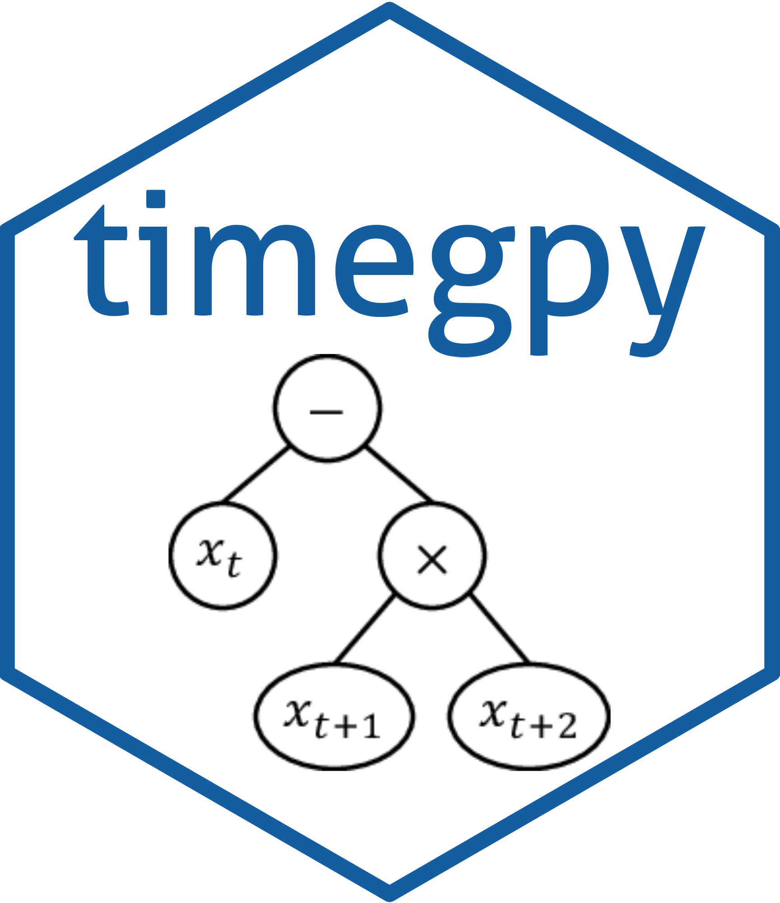

# timegpy 

Find informative time-average features using genetic programming

## Installation

You can install `timegpy` via GitHub:

```{python}
pip install git+https://github.com/hendersontrent/timegpy
```

## How-to guide

Please consult the extensive [documentation](http://timegpy.readthedocs.io/) for a complete walkthrough of package functionality and detailed explanations of `timegpy`'s internal statistical and genetic programming framework.

## Purpose

`timegpy` (“genetic programming for time-series features”) is a simple and lightweight Python package for finding informative time-average ‘features’ that can distinguish between classes. A time-series feature is a summary statistic which returns a scalar for each time series which summarises some property, such as the value of the autocorrelation function at lag 1, or the variance of sliding window variances taken across the time series (see [this paper](https://royalsocietypublishing.org/doi/abs/10.1098/rsif.2013.0048), [this paper](https://www.sciencedirect.com/science/article/pii/S2405471217304386), and [this book chapter](https://www.taylorfrancis.com/chapters/edit/10.1201/9781315181080-4/feature-based-time-series-analysis-ben-fulcher) for more).

Time-average features -- such as `mean(Xt * Xt+1)` -- have shown utility in solving time-series problems across the sciences but have yet to be systematically applied to time-series classification problems. Time-average features are desirable quantities because they are highly interpretable—for example, `mean(Xt * Xt+1)` represents the average of the product of values at each time point and the time point one ahead of it. In the case of *z*-scored data, this represents the autocorrelation function at
lag 1. This interpretability then leads to an intuitive understanding of why two or more classes might be well distinguished from one another. Once identified, useful and informative time-average features can then be used to either infer differences in temporal dynamics or train a further state-of-the-art classification algorithm for out-of-sample prediction.

## Development

`timegpy` is still an active work-in-progress. Please check back
regularly for updates and/or new functionality.