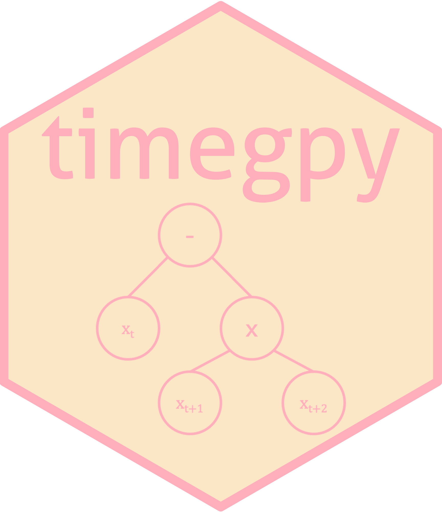

# timegpy 

Find informative time-average features using genetic programming

## Installation

You can install `timegpy` via GitHub:

```{python}
pip install git+https://github.com/hendersontrent/timegpy.git
```

## How-to guide

Please consult the extensive [documentation](http://timegpy.readthedocs.io/) for a complete walkthrough of package functionality and detailed explanations of `timegpy`'s internal statistical and genetic programming framework.

## Purpose

`timegpy` (“genetic programming for time-series features”) is a simple and lightweight Python package for finding informative time-average ‘features’ that can distinguish between classes. A time-series feature is a summary statistic which returns a scalar for each time series which summarises some property, such as the value of the autocorrelation function at lag 1, or the variance of sliding window variances taken across the time series (see [this paper](https://royalsocietypublishing.org/doi/abs/10.1098/rsif.2013.0048), [this paper](https://www.sciencedirect.com/science/article/pii/S2405471217304386), and [this book chapter](https://www.taylorfrancis.com/chapters/edit/10.1201/9781315181080-4/feature-based-time-series-analysis-ben-fulcher) for more).

Time-average features -- such as `mean(Xt * Xt+1)` -- have shown utility in solving time-series problems across the sciences but have yet to be systematically applied to time-series classification problems. Time-average features are desirable quantities because they are highly interpretable—for example, `mean(Xt * Xt+1)` represents the average of the product of values at each time point and the time point one ahead of it. In the case of *z*-scored data, this represents the autocorrelation function at
lag 1. This interpretability then leads to an intuitive understanding of why two or more classes might be well distinguished from one another. Once identified, useful and informative time-average features can then be used to either infer differences in temporal dynamics or train a further state-of-the-art classification algorithm for out-of-sample prediction.

## Example usage

The core function of `timegpy` is `tsgp` which has an extensive set of configurable parameters that control the genetic algorithm's search space (see the [documentation](http://timegpy.readthedocs.io/) for all the details). Here is a small example to find the best feature which distinguishes Gaussian noise from an autoregressive process at lag 1 -- i.e., AR(1) using default settings in `tsgp`:

### Step 1: Simulate some data

```python
def generate_ar1_vs_noise(N, T, phi, seed=None):
    if seed is not None:
        np.random.seed(seed)

    # Generate AR(1) samples

    ar1_data = np.zeros((N, T))
    for i in range(N):
        noise = np.random.normal(0, 1, T)
        ar1 = np.zeros(T)
        ar1[0] = noise[0]
        for t in range(1, T):
            ar1[t] = phi * ar1[t - 1] + noise[t]
        ar1_data[i] = ar1

    # Generate Gaussian noise samples

    noise_data = np.random.normal(0, 1, (N, T))

    # Concatenate

    X = np.vstack([ar1_data, noise_data])

    # Create class labels

    y = np.array([1] * N + [0] * N)
    return X, y

X, y = generate_ar1_vs_noise(N=100, T=100, phi=0.8, seed=123)
```

### Step 2: Run tsgp with some basic settings

```python
df_all, df_best = tsgp(X, y, pop_size=1000, n_generations=20, n_procs=4)
```

`tsgp` returns two objects: 

1. Data frame containing all time-average features across all generations and their fitness scores
2. Data frame containing the best individual time-average feature and its fitness score

### Step 3: Interpret results

You can then easily visualise results using the built-in plotting functions. Here is an example visualising class distributions on the single best performing feature identified by `tsgp` (which, in this case, is correctly identified as `"mean(X_t+0 * X_t+1)"`, or in other words, the value of the autocorrelation function at lag 1, for *z*-scored data):

```python
expression = df_best.iloc[0]['expression']
plot_hist(expression, X, y, z_score=True)
```


Notice that the noise time series are distributed around 0 (i.e., no autocorrelation structure at lag 1) while the AR(1) time series are distributed around the value we set for the autocorrelation coefficient of 0.8. This is a nice ground truth validation of the algorithm.

### Additional functionality

`timegpy` also contains a host of other functionality, such as the ability to print ASCII-style tree representations of time-average features to the console:

```python
feature_tree("mean((X_t * X_t+1^3))")

└── *
    ├── X_t
    └── ^
        ├── X_t+1
        └── 3
```

And the ability to plot the Pareto front of all features found across all generations:

```python
plot_pareto(df_all, df_best, use_parsimony=True, level=0.95)
```


*NOTE: Negative fitness values are permitted in the current implementation of `timegpy` if parsimony is used. This is because the current fitness statistic is in the domain* $[0,1]$ *meaning that complex time-average features that perform poorly are penalised.*

## Computational efficiency

`timegpy` can be run both in serial and parallel, with the parallel option scaling to the available computing resources. Here is an example of indicative computation time to find the correct feature `"mean(X_t+0 * X_t+1)"` and hit the stopping rule of 'no generational improvement' on an Apple MacBook Pro with a six-core Intel i7 processor for various sample sizes, where the parallel option was run with four processes, using time-series length T = 100, and a population size of 1000 features per generation:


*Note that computation time also scales with time-series length when calculating time-average features.*

## Development

`timegpy` is still an active work-in-progress. Please check back
regularly for updates and/or new functionality.