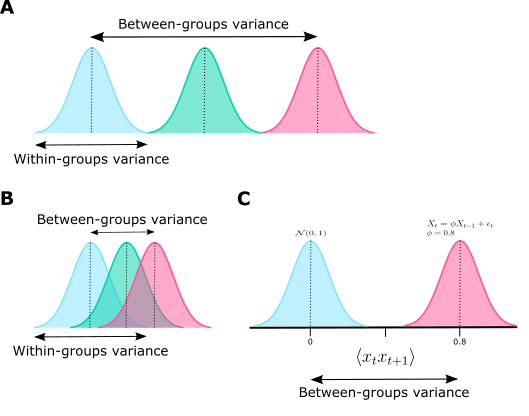

Fitness calculation approach
============================

Theoretical basis
-----------------

There are countless ways to calculate and optimise fitness for a classification context, with common loss functions including Sigmoid loss, zero-one loss, and L1 hinge loss. ``timegpy`` instead takes a more statistical approach to fitness by implementing one-way analysis of variance (ANOVA) for the calculation of time-average feature fitness. A one-way ANOVA compares whether the means of two or more samples are different, using the *F*-distribution as the null hypothesis. The *F*-statistic of a one-way ANOVA with two groups is equivalent to the square of the *t*-statistic from a Student's *t*-test, however, ANOVA is generalisable to *N* number of groups---which is critical, as many time-series classification problems are multi-class problems. We use a one-way test because we seek to quantify group differences with only one time-average feature at a time (i.e., there is a single explanatory variable).

From an interpretation standpoint, ANOVA is simple and intuitive. The *F*-statistic is a ratio between the mean square of the between-groups variance (i.e., how different the group means are from one another) and the within-groups variance (how dispersed each group's distribution is about its mean)---both of which are derived from sums of squares:

.. math:: 
  F = \frac{MS_{\text{between}}}{MS_{\text{within}}}

It follows for our context that a time-average feature with a large *F*-statistic can effectively discern between the means of the groups in the data, making it a useful property for distinguishing between classes. While other methods presented in the classification literature---such as mean square error or F1 score--- also provide information regarding the ability to discern between classes, their usage typically requires the fitting of a statistical learning model which introduces two issues. First, the choice of model becomes a dominating component of the algorithm's design---which detracts from the true purpose which is to find informative time-series features, not build a production-ready prediction model. Second, results may be sensitive to the hyperparameters chosen for the model(s), again placing an undesirably heavy emphasis on the non-genetic programming facets of the algorithm. Third, the computational cost of a machine learning model can be high, where cubic time complexities are not uncommon, such as in Gaussian process models. In contrast, ANOVA is highly efficient, and is a well-optimized technique in Python. Finally, ANOVA can easily scale to any number of groups with no change to its computational machinery. In comparison, many machine learning performance metrics---such as classification accuracy---are sensitive to class imbalances, and often demand alternatives such as balanced classification accuracy.

Since the *F*-statistic is a ratio, it can take on potentially very small and very large values where parsimony penalties may have little impact. To compensate, we then convert the *F*-statistic to eta squared to form the final fitness metric. Eta squared is a common measure of effect size which lies in the domain of :math:`[0,1]`. We do this conversion using the formulation of `Lakens (2013) <https://www.frontiersin.org/journals/psychology/articles/10.3389/fpsyg.2013.00863>`_ which is comprised of the *F*-statistic and its associated degrees of freedom `Cohen (1995) <https://psycnet.apa.org/record/1995-12080-001>`_:

.. math:: 
  \eta^{2} = \frac{F \times df_{\text{effect}}}{F \times df_{\text{effect}} + df_{\text{error}}}

Whilst the primary motivation for using eta squared is computational to enable meaningful parsimony, the secondary benefit is that it is a highly interpretable quantity. Specifically, eta squared represents the proportion of the variance in the variable (i.e., the time-average feature) that is associated with membership of the different classes. For example, an eta squared value of :math:`0.90` means that :math:`90\%` of the total variance in the time-average feature can be accounted for by group membership. In other words, that particular time-average feature is a strong candidate because it can effectively discern between the classes with no other information. However, we acknowledge that in the case of an adjusted fitness metric, the quantity is no longer eta squared since we are accounting for feature expression size and the parsimony coefficient.

Despite this, the interpretation of the parsimony coefficient itself is highly interpretable. Assume that a parsimony coefficient of :math:`c = 0.001` was either found by the algorithm or specified manually. For the time-average feature :math:`\langle x_{t} x_{t+1} \rangle`, with an expression size of :math:`\ell = 3` and an :math:`\eta^{2} = 0.90`, this particular :math:`c` would reduce the fitness statistic (i.e., the variance explained by group membership) by :math:`0.001 \times 3 = 0.003` to :math:`\eta^{2}_{\text{adjusted}} = 0.897`. In comparison, assume the time-average feature :math:`\langle x_{t} x_{t+1} - x_{t+3}^2 \rangle` exhibited a marginally higher :math:`\eta^{2} = 0.903`. This feature's expression size is :math:`\ell = 7`, meaning that the impact of parsimony would be :math:`0.001 \times 7 = 0.007`, resulting in :math:`\eta^{2}_{\text{adjusted}} = 0.896`. The algorithm would then select :math:`\langle x_{t} x_{t+1} \rangle` over :math:`\langle x_{t} x_{t+1} - x_{t+3}^2 \rangle` based on the adjusted fitness score, as the more complex expression's performance was not sufficiently large enough to outweigh its complexity in this case.

Prior to deciding on eta squared as the fitness metric, the *p*-value associated with the *F*-statistic (i.e., the probability of obtaining a result at least as extreme as the one we observed if the null hypothesis that there is no difference in group means is true) was first considered. This placed the objective function in a minimisation context instead. However, initial testing resulted in large numbers of identically performing features due to issues with floating point precision---the larger program size values in the adjusted fitness function dominated the tiny *p*-values that were incredibly close to :math:`0`. Testing confirmed that eta squared was not impacted by this issue.

The ANOVA approach to fitness in ``timegpy`` is summarised graphically below:

**A** represents a case where each class is well separated by the numerical variable, as the ratio of between-groups variance and within-groups variance (i.e., the *F*-statistic) is high. **B** represents a case where classes are not well distinguished by the numerical variable, as the ratio of between-group variance and within-groups variance is low. **C** represents the expected differences between :math:`\mathrm{iid}` noise and an AR(1) process with an autoregressive coefficient of :math:`\phi = 0.8` on the time-average feature :math:`\langle x_{t}x_{t+1} \rangle`. The noise time series should exhibit a distribution around zero since there is no lag one autocorrelation in its data generating process. The AR(1) process, however, would be distributed around the coefficient value, since the feature is essentially measuring the average strength of the relationship between one-time-point lagged values.
