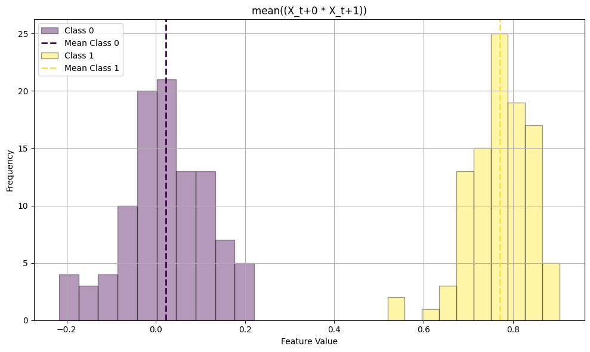

Quickstart
==========

Installation
------------

You can install ``timegpy`` using pip:

.. code::
   
     pip install git+https://github.com/hendersontrent/timegpy

Usage
-----

``timegpy`` ("genetic programming for time-average features") is a Python package for finding informative time-average 'features' that can distinguish between classes. A time-series feature is a summary statistic which returns a scalar for each time series which summarises some property, such as the value of the autocorrelation function at lag 1, or the variance of sliding window variances taken across the time series (see `this paper <https://royalsocietypublishing.org/doi/abs/10.1098/rsif.2013.0048>`_, `this paper <https://www.sciencedirect.com/science/article/pii/S2405471217304386>`_, and `this book chapter <https://www.taylorfrancis.com/chapters/edit/10.1201/9781315181080-4/feature-based-time-series-analysis-ben-fulcher>`_ for more). 

Time-average features---quantities of the functional form $\langle f(x_1, x_2, \dots, x_n)_t \rangle$ such as $\langle X_{t}X_{t+1} \rangle$ --- have shown utility in solving time-series problems across the sciences but have yet to be systematically applied to time-series classification problems. Time-average features are highly interpretable, which means they can be used to develop an intuitive understanding of why two classes might be well distinguished from one another by their temporal dynamics.

This tutorial will walk through basic functionality of the package using a simulated example. We will first generate some data, where we have n = 100 samples from an `autoregressive process of lag 1 <https://en.wikipedia.org/wiki/Autoregressive_model>`_ with an autoregressive coefficient of $\phi = 0.8$, and n = 100 samples drawn from simple Gaussian noise (with mean 0 and standard deviation 1), where every time series is T = 100 long:

.. code::
   
   >>> import numpy as np
   >>> from timegpy.gp import tsgp
   >>> from timegpy.plots import plot_feature

   >>> # Simulate Gaussian noise and AR(1) data

   >>> def generate_ar1_vs_noise(N, T, phi, seed=None):
   >>>      if seed is not None:
   >>>          np.random.seed(seed)

   >>>      # AR(1) samples

   >>>      ar1_data = np.zeros((N, T))
   >>>      for i in range(N):
   >>>          noise = np.random.normal(0, 1, T)
   >>>          ar1 = np.zeros(T)
   >>>          ar1[0] = noise[0]
   >>>          for t in range(1, T):
   >>>              ar1[t] = phi * ar1[t - 1] + noise[t]
   >>>          ar1_data[i] = ar1

   >>>      # Gaussian noise samples

   >>>      noise_data = np.random.normal(0, 1, (N, T))

   >>>      # Combine

   >>>      X = np.vstack([ar1_data, noise_data])

   >>>      # Labels
   >>>      y = np.array([1] * N + [0] * N)

   >>>      return X, y

   >>> X, y = generate_ar1_vs_noise(N=100, T=100, phi=0.8, seed=123)

Structure of time-average feature expressions in timegpy
^^^^^^^^^^^^^^^^^^^^^^^^^^^^^^^^^^^^^^^^^^^^^^^^^^^^^^^^

In ``timegpy``, features are represented as strings to the user, but trees internally. For example, a time-average feature representing lag 1 autocorrelation function (on *z*-scored data) $\langle x_{t}x_{t+1} \rangle$ would be represented as ``"X_t+0 * X_t+1"``. More complex features may include exponents, such as ``"X_t+0 + X_t+1 ^ 3"`` and/or numerous other combinations of time lags.

From a statistical perspective, for this tutorial example, we would expect to see the *best* performing feature to be ``"X_t+0 * X_t+1"`` sd this corresponds to the value of the autocorrelation function at lag 1---which we know from the data simulation code above to be the distinguishing temporal difference between the two processes. This creates a nice ground truth test case for the algorithm.

Doing genetic programming in timegpy
^^^^^^^^^^^^^^^^^^^^^^^^^^^^^^^^^^^^

The core function in ``timegpy`` is ``tsgp`` ('time-series genetic programming'). We can exercise high degrees of control over the algorithm's evolution by adjusting the large number of available arguments. Here is a simple call using all of the default parameters:

.. code::
   
   >>> X, y, df_all, df_best = tsgp(X, y)

``tsgp`` returns four objects:

1. Input matrix ``X``
2. Class label vector ``y``
3. Data frame containing all time-average features across all generations and their fitness scores
4. Data frame containing the best individual time-average feature and its fitness score

Despite the simplicity of the above call, it is highly likely that users will seek to adjust the numerous parameters to their task. Here is a breakdown of the available arguments:

* ``X`` (array): ID by time matrix containing time-series data
* ``y`` (array): vector of class labels for each row of ``X``
* ``pop_size`` (int): size of each population. Defaults to ``100``
* ``n_generations`` (int): maximum number of generations. Defaults to ``5``
* ``fitness_threshold`` (float): objective function value which if equalled or exceeded, will terminate the algorithm. Defaults to ``0.95``
* ``p_point_mutation`` (float): probability of point mutation occurring. Defaults to ``0.01``
* ``p_subtree_mutation`` (float): probability of subtree mutation occurring. Defaults to ``0.01``
* ``p_hoist_mutation`` (float): probability of hoist mutation occurring. Defaults to ``0.01``
* ``p_crossover`` (float): probability of crossover occurring. Defaults to ``0.9``
* ``p_exponent`` (float): probability of a time lag being exponentiated. Defaults to ``0.3``
* ``tournament_size`` (int): size of each tournament to find a suitable parent. Defaults to ``20``
* ``use_parsimony`` (bool): whether to use parsimony-adjusted fitness instead of raw fitness. Defaults to ``True``
* ``auto_parsimony`` (bool): whether to calculate generational parsimony coefficients dynamically. Defaults to ``True``
* ``parsimony_coefficient`` (float): if ``auto_parsimony = False``, this static coefficient for parsimony will be applied to all generations. Defaults to ``0.001``
* ``verbose`` (bool): whether to print updates of algorithm progress. Defaults to ``False``
* ``max_depth`` (int): maximum number of time-lag terms allowed in a single feature expression. Defaults to ``8``
* ``max_lag`` (int): maximum time-lag allowed in a single feature expression. Defaults to ``8``
* ``max_exponent`` (int): maximum exponent allowed. Defaults to ``5``
* ``seed`` (int): fixes Python's random seed for reproducibility. Defaults to ``123``
* ``n_generation_improve`` (int): number of generations of no fitness improvement before algorithm terminates early. Defaults to ``1``
* ``z_score`` (bool): whether to z-score input data X. Defaults to ``True``

Important parameter notes
^^^^^^^^^^^^^^^^^^^^^^^^^

``fitness_threshold`` must be less than or equal to ``1`` and greater than ``0`` as the current objective function maximises values between ``0`` and ``1``.

The values of ``p_point_mutation``, ``p_subtree_mutation``, ``p_hoist_mutation``, and ``p_crossover`` must sum to less than ``1`` as the remaining probability is allocated to 'no change'.

``parsimony_coefficient``, if used, must be less than ``1`` otherwise it does not represent a complexity penalty.

Additional graphical tools
^^^^^^^^^^^^^^^^^^^^^^^^^^

``timegpy`` also contains functionality for interpreting a visualising genetic programming outputs. For example, users may seek to visualise class separation according to the best time-average feature (or any other). The convenience function ``plot_feature`` has been included for this purpose. It only requires a time-average feature expression as a string (using the conventions of ``timegpy``), the input data ``X``, and the class label vector ``y``. Here is an example using the best found expression from the above example:

.. code::
   
   >>> expression = df_best.iloc[0]['expression']
   >>> plot = plot_feature(expression, X, y)
   >>> plot.show()

Intuitively, we see the Gaussian noise time series distributed around a feature value of ``0`` and the AR(1) data (Class 1) distributed around ``0.8``---which we know to be the autoregressive coefficient we used to generate the data. This, combined with the fact that ``"X_t+0 * X_t+1"`` was found to be the best time-average feature for classifying the time series, solidifies that the algorithm is working as expected.

Evaluating individual time-average feature expressions
^^^^^^^^^^^^^^^^^^^^^^^^^^^^^^^^^^^^^^^^^^^^^^^^^^^^^^

Outside of the core genetic programming algorithm contained in ``tsgp``, ``timegpy`` can also calculate time-average feature values for any given string representation of an expression and the input matrix:

.. code::
   
   >>> feature_values = evaluate_expression("mean((X_t+0 * X_t+1))", X)
